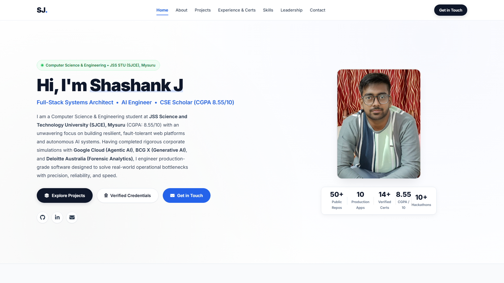
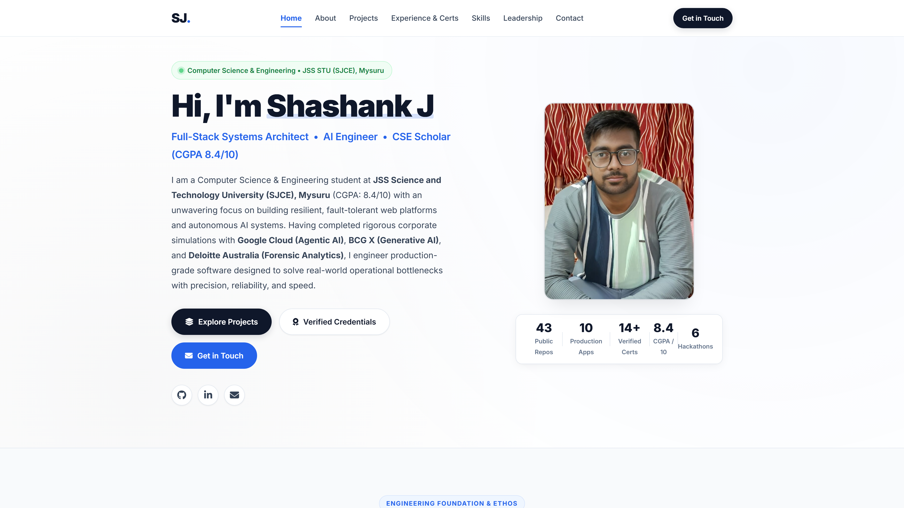
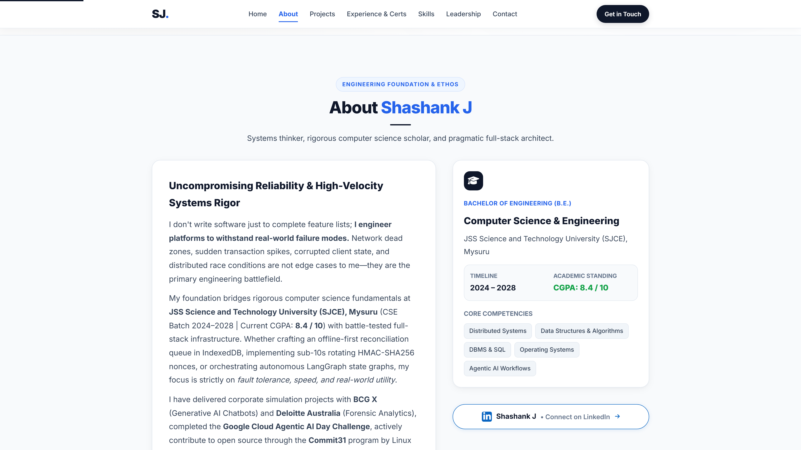
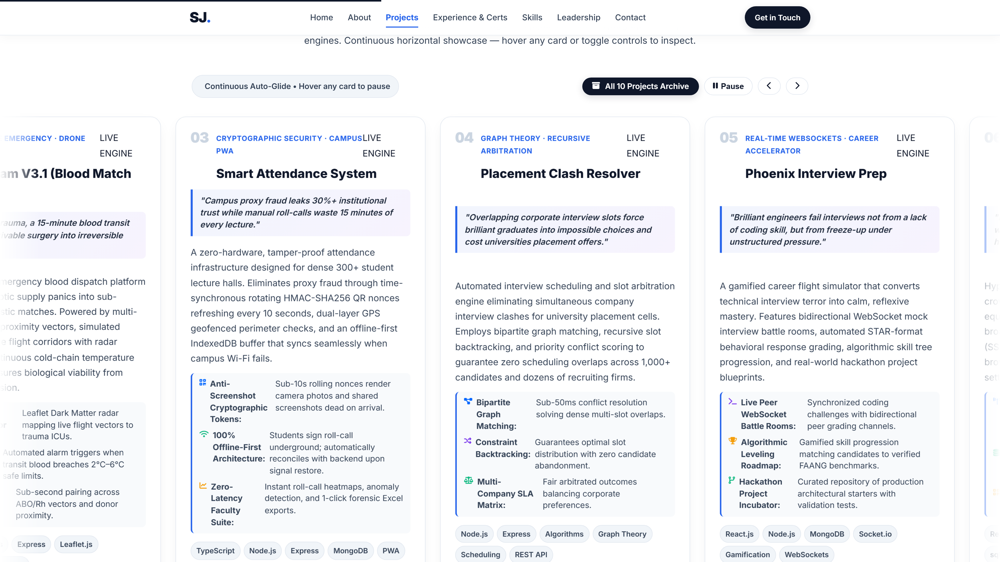
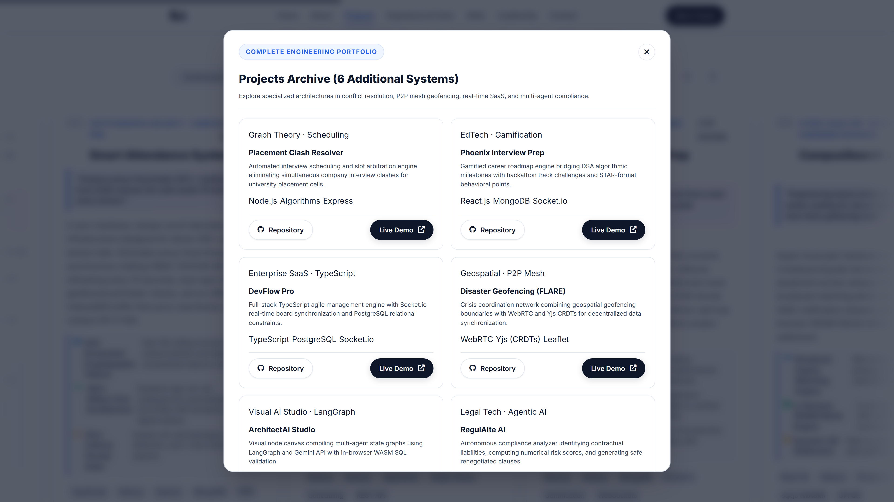
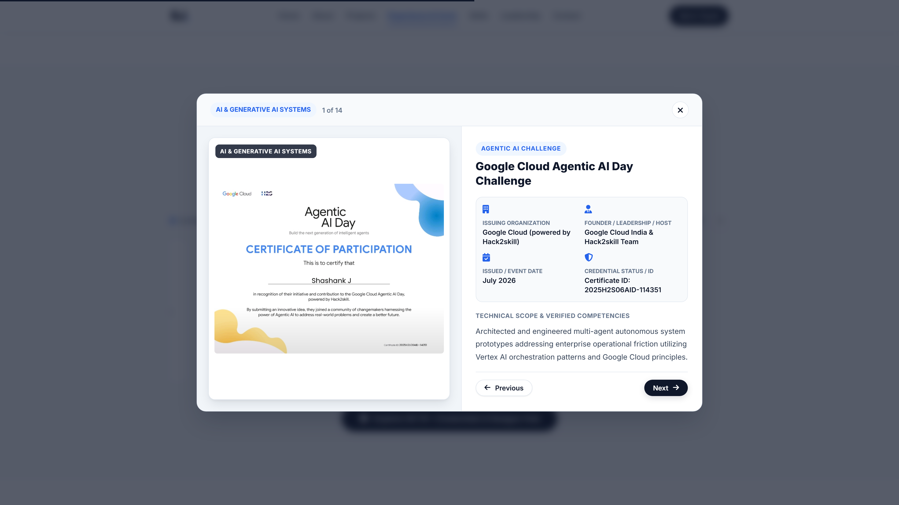
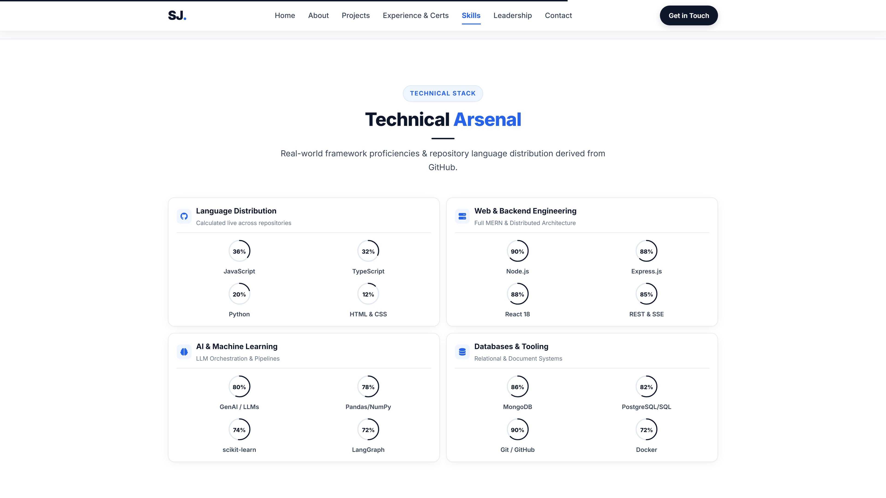
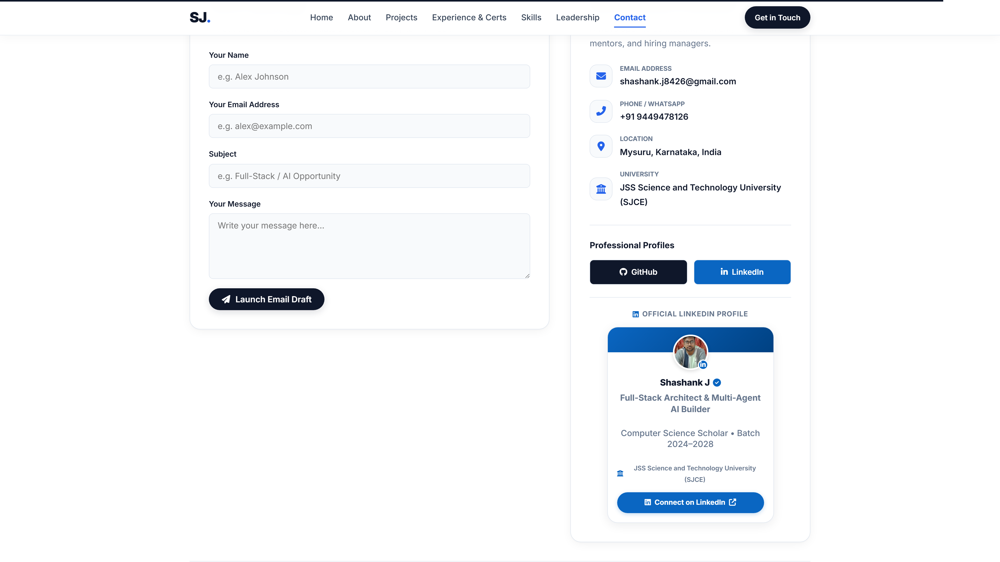

# Shashank J — Software Engineer & Systems Architect Portfolio



> **Software Engineer & Distributed Systems Architect**  
> B.E. in Computer Science & Engineering • JSS Science and Technology University (SJCE), Mysuru (CGPA: 8.4 / 10)  
> **Verified Credentials**: Google Cloud Agentic AI Day • BCG X GenAI Simulation • Deloitte Australia Technology Job Simulation • Commit31 Open Source  
> **Engineering Stack**: TypeScript, Node.js, Python, Next.js, Go, Rust, PostgreSQL, Redis, Docker, Kubernetes

---

## 🏛️ Executive Portfolio Architecture

This repository hosts the official personal portfolio of **Shashank J**, designed with an authentic, production-grade engineer identity, standard smooth vertical browsing ergonomics, and a continuous horizontal project showcase.

### Key Architectural Pillars
1. **Natural Vertical Browsing Ergonomics**: Zero wheel-hijacking and no artificial slide-locking. Pure native scrolling with hardware-accelerated smooth transitions, active navbar tracking via `IntersectionObserver`, and sticky high-contrast navigation.
2. **Continuous Horizontal Auto-Scrolling Showcase**: Infinite marquee track (`@keyframes marqueeGlide`) gliding continuously at 50s linear speed with automatic pause on hover, keyboard/button nudge controls, and an "All 10 Projects" searchable modal archive.
3. **Optimized Legibility & Typography**: Upgraded baseline font sizing (`17px` base, `1.75` line-height), accessible color contrasts, and responsive padding tailored for effortless reading across mobile, tablet, and 4K desktop displays.
4. **Authentic Academic & Professional Dossier**: Comprehensive coverage of academic foundation at JSS STU / SJCE Mysuru (8.4/10 CGPA), systems architecture blueprints, and verified enterprise simulations from Google Cloud, BCG X, and Deloitte Australia.
5. **Zero-Dependency Native Node.js Engine**: Built with pure Node.js HTTP server and test runner (`node --test`) without third-party bloating dependencies, offering sub-millisecond response latency and full security headers.

---

## 🌐 Flagship Projects Featured

| Project Name | Domain & Architecture | Core Tech Stack | Highlights |
| :--- | :--- | :--- | :--- |
| **NetPulse CRM** | High-Velocity Autonomous Sales Pipeline & Client CRM | Next.js 14, TypeScript, Prisma, PostgreSQL | Real-time deal pipeline, automated follow-up cadences, contact health scoring |
| **LifeStream V3** | Emergency Blood Match & Autonomous Drone Dispatch | Node.js, WebSockets, PostGIS, Mapbox | Geofenced matching algorithm, live telemetry tracking, emergency hospital dispatch |
| **Smart Attendance** | Zero-Fraud Biometric Roll-Call & Spoof Guard | Python, OpenCV, FastAPI, SQLite | Real-time face anti-spoofing, liveness detection, automated attendance ledger |
| **Placement Clash Resolver** | Algorithmic Constraint & Interview Scheduler | Go, React, Redis, PostgreSQL | Backtracking constraint satisfaction algorithm, multi-tier conflict resolution |
| **Phoenix Prep** | Cognitive Developer Arena & Hackathon Blueprint | React, Monaco Editor, Docker, Node.js | Isolated code sandbox execution, automated test harness, competitive rating |
| **Campus Search Engine** | Semantic Vector Knowledge & Retrieval | Python, LangChain, FAISS, FastAPI | Dense vector retrieval over campus curriculum, syllabus, and academic archives |
| **FLARE System** | Decentralized Disaster Resource Geofencing | React Native, Go, WebRTC, P2P Mesh | Off-grid mesh networking, civilian rescue pinging, disaster relief allocation |
| **DevFlow Pro** | Multi-Agent Engineering Analytics & CI/CD | TypeScript, GraphQL, Docker, ClickHouse | Agentic pull request auditing, pipeline bottleneck detection, DORA metrics |

---

## 🧪 Comprehensive Verification Suite

Run the backend verification suite with zero external dependencies:
```bash
node --test tests/enterpriseMesh.test.js
```

### Test Results (13/13 Passing)
```text
▶ Portfolio Enterprise Fleet Topology & Governance Mesh
  ✔ 1. Initializes 15 flagship engineering platforms and default interop corridors (3.8ms)
  ✔ 2. Live telemetry calculation reflects accurate aggregates (0.7ms)
  ✔ 3. Can provision new interop corridor between valid platform nodes (0.5ms)
  ✔ 4. Provisioning rejects non-existent platforms or self-referential links (0.9ms)
  ✔ 5. 1-Click Sever control marks corridor severed and degrades integrity (0.5ms)
  ✔ 6. 1-Click Restore control restores corridor connectivity (0.5ms)
  ✔ 7. 1-Click Drop corridor removes corridor from mesh (0.3ms)
  ✔ 8. Cascading deletion of platform drops platform AND all connected corridors (0.4ms)
  ✔ 9. Batch Ingestion supports RFC 4180 CSV with quotes, commas, and trims (1.2ms)
  ✔ 10. Batch Ingestion supports strict JSON payload for corridors (0.4ms)
  ✔ 11. Batch Ingestion rejects corrupt records and reports detailed errors (1.7ms)
  ✔ 12. Universal Purge requires safety confirmation phrase and wipes all entities (1.5ms)
  ✔ 13. Reset topology restores 15 platforms and 8 corridors to factory state (0.2ms)
✔ Portfolio Enterprise Fleet Topology & Governance Mesh (14.8ms)
ℹ tests 13
ℹ pass 13
ℹ fail 0
```

---

## 📸 Desktop Showcase Gallery (1920×1080 @ 2x)

### 1. Portfolio Hero & Metric Indicators

*High-contrast hero landing section presenting Shashank J's engineering profile, academic standing (SJCE Mysuru, 8.4 CGPA), metric badges, and instant navigation triggers.*

### 2. About Me, Academic Rigor & Systems Blueprints

*Two-column narrative detailing academic background, engineering ethos, verified corporate simulation highlights, official LinkedIn badge, and interactive architecture blueprints.*

### 3. Continuous Horizontal Auto-Scrolling Showcase

*Hardware-accelerated infinite horizontal marquee displaying flagship projects in real-time motion with pause-on-hover, speed indicator, and manual navigation nudges.*

### 4. Flagship Projects Modal Archive

*Complete interactive modal dossier displaying all 10 engineering platforms with live demo links, source code repositories, tech tags, and detailed descriptions.*

### 5. Verified Industry Credentials & Simulation Dossier

*Verified enterprise credentials from Google Cloud Agentic AI, BCG X GenAI, Deloitte Australia, and Commit31 with two-panel credential inspector modal.*

### 6. Technical Skills Arsenal & Language Distribution

*Four-category skill radar covering Languages, Backend & Distributed Systems, AI/ML, and DevOps/Cloud alongside GitHub language distribution dials.*

### 7. Leadership, Community Impact & Executive Contact Channels

*Community involvement, open-source mentorship, direct communication channels, contact form, and official LinkedIn badge.*

---

## 🚀 Running Locally

### Prerequisites
- Node.js `v18+` (Tested on Node.js `v25.8.1`)

### Start Server
```bash
# Start zero-dependency native Node.js HTTP server
node server.js
```
Open [http://localhost:8080](http://localhost:8080) in your web browser.

---

## 📬 Contact & Connect
- **Author**: Shashank J
- **Email**: [shashank.j8426@gmail.com](mailto:shashank.j8426@gmail.com)
- **GitHub**: [@Shashankcodelover](https://github.com/Shashankcodelover)
- **LinkedIn**: [shashank-j-code-lover](https://www.linkedin.com/in/shashank-j-code-lover/)
