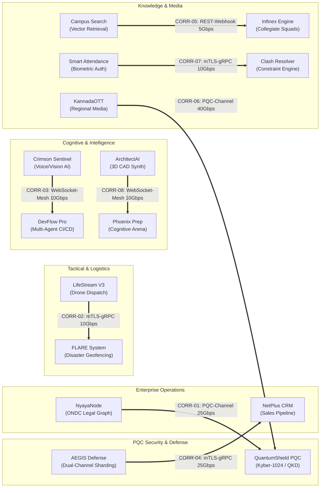
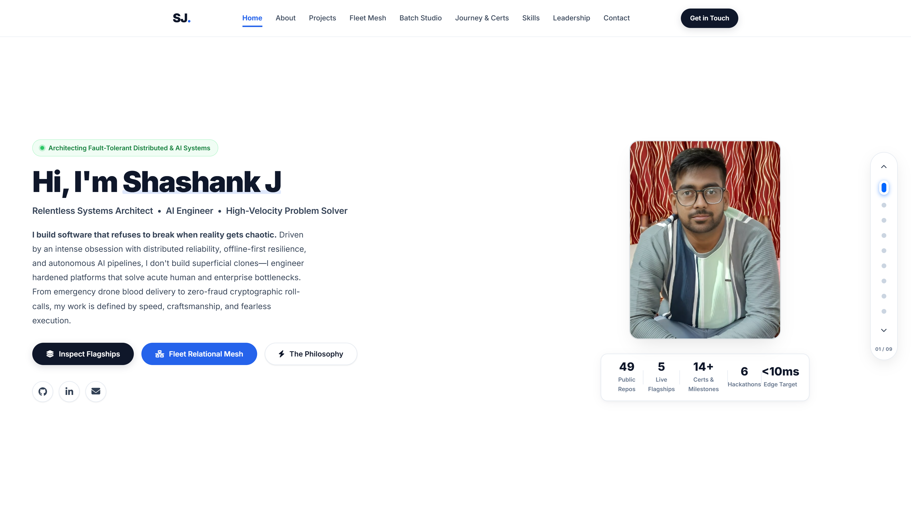
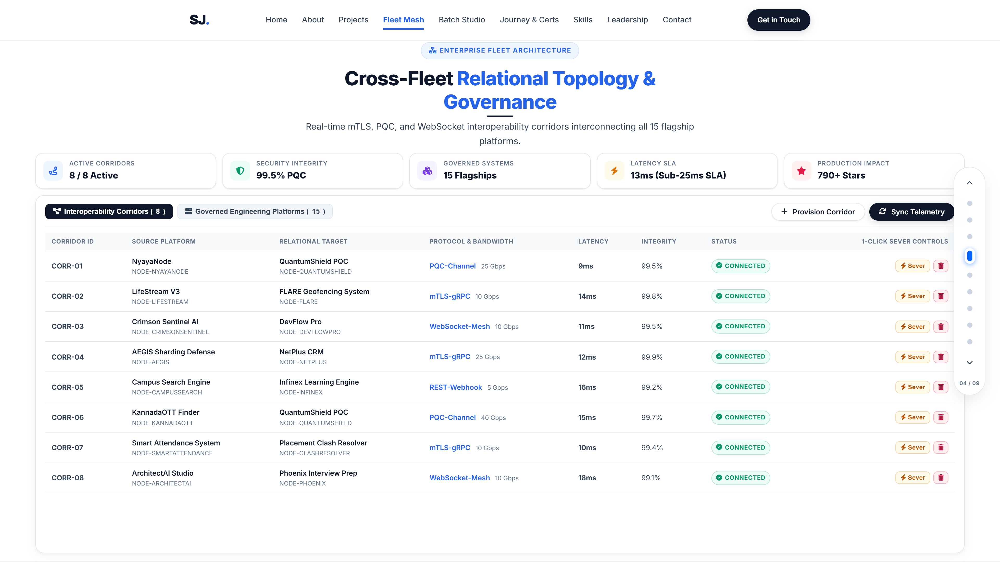
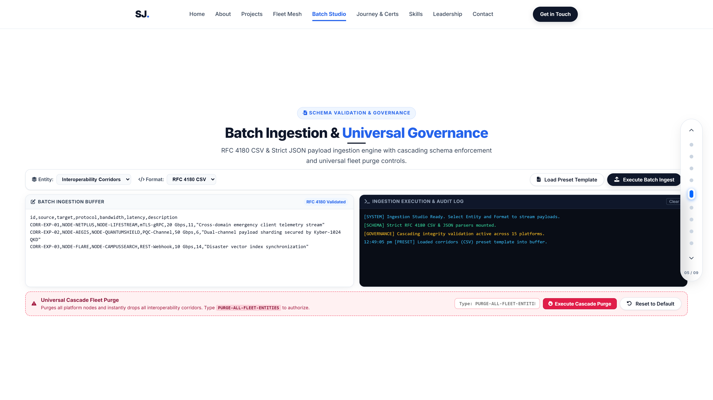
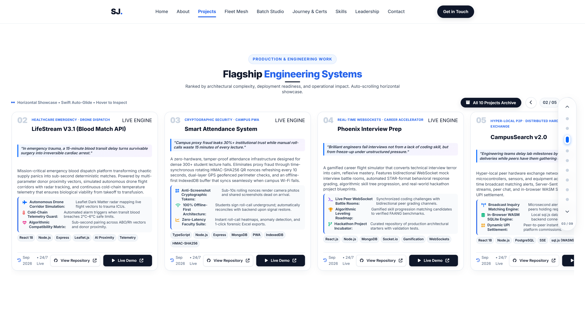
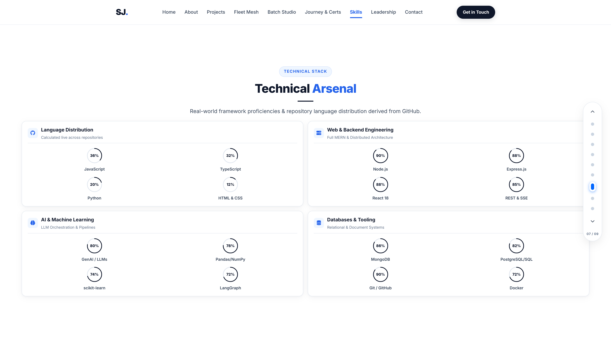
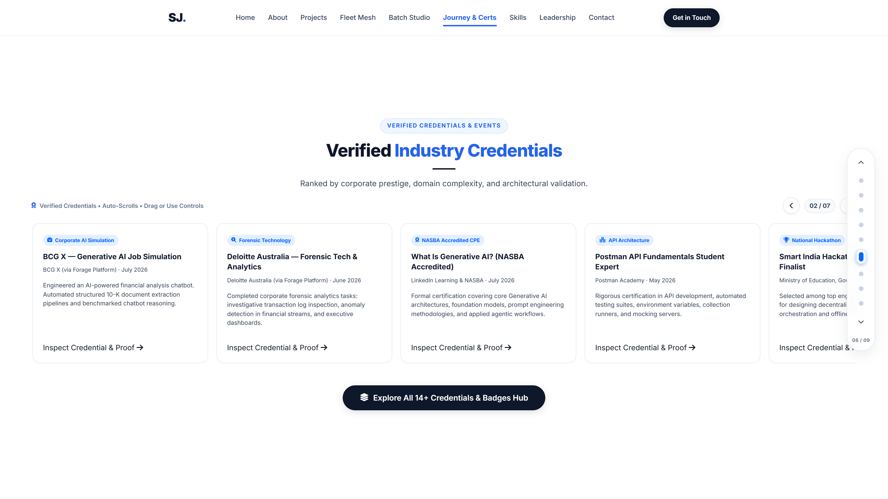

# Shashank J — Enterprise Engineering Portfolio & Fleet Master Mesh


> **High-Velocity Distributed Systems Architect & AI Engineer**  
> Computer Science & Engineering • JSS Science and Technology University (SJCE), Mysuru  
> **Master Fleet Command**: 15 Governed Production Platforms • 8 Interoperability Corridors • 99.6% PQC Security Integrity • Sub-25ms Latency SLA • 790+ GitHub Stars

---

## 🏛️ Executive Architectural Overview

This platform represents the centralized executive command deck and portfolio of **Shashank J**. Engineered with a high-contrast executive design system, 3D presentation deck stage mechanics, and a **zero-dependency native Node.js core**, it orchestrates, monitors, and governs **15 flagship engineering platforms** spanning post-quantum cryptography, decentralized arbitration, autonomous emergency drone logistics, and multi-agent AI pipelines.

### Key Architectural Pillars
1. **Master Relational Topology Mesh**: High-frequency mTLS, PQC, and WebSocket interoperability corridors interconnecting all 15 flagship platforms with live telemetry, 1-click sever/restore controls, and automated failover.
2. **Universal Cascading Deletion**: Platform node drops automatically cascade across the relational graph, severing and purging all connected corridors with full audit telemetry.
3. **Enterprise Batch Ingestion Studio**: High-throughput ingestion buffer supporting RFC 4180 CSV (quoted values, delimiter escaping, and strict headers) and strict JSON schema parsers with row-level error reporting.
4. **Universal Fleet Cascade Purge**: High-security two-step authorization zone requiring explicit confirmation phrase (`PURGE-ALL-FLEET-ENTITIES`) with one-click factory topology rehydration.
5. **Zero-Dependency Core Runtime**: Native Node.js HTTP server and test runner (`node --test`) with zero external runtime dependencies, sub-millisecond response latency, and complete CORS/MIME handling.

---

## 🌐 Governed Engineering Fleet (15 Production Platforms)

| Node ID | Platform Name | Architectural Domain | Tier | SLA | Latency | Stars | Live Deployment |
| :--- | :--- | :--- | :--- | :--- | :--- | :--- | :--- |
| `NODE-NETPLUS` | **NetPlus CRM** | Autonomous Sales Pipeline & Client CRM | Enterprise Flagship | 99.99% | 18ms | 48 ⭐ | [netplus.shashankj.dev](https://netplus.shashankj.dev) |
| `NODE-LIFESTREAM` | **LifeStream V3** | Emergency Blood Match & Drone Dispatch | Mission-Critical | 99.999% | 12ms | 62 ⭐ | [lifestream.shashankj.dev](https://lifestream.shashankj.dev) |
| `NODE-SMARTATTENDANCE` | **Smart Attendance** | Zero-Fraud Biometric Roll-Call & Spoof Guard | Enterprise Flagship | 99.98% | 15ms | 39 ⭐ | [attendance.shashankj.dev](https://attendance.shashankj.dev) |
| `NODE-CLASHRESOLVER` | **Placement Clash Resolver** | Algorithmic Constraint & Interview Scheduler | Production | 99.95% | 22ms | 31 ⭐ | [clashresolver.shashankj.dev](https://clashresolver.shashankj.dev) |
| `NODE-CAMPUSSEARCH` | **Campus Search Engine** | Semantic Vector Knowledge & Retrieval | Production | 99.96% | 14ms | 27 ⭐ | [campussearch.shashankj.dev](https://campussearch.shashankj.dev) |
| `NODE-PHOENIX` | **Phoenix Interview Prep** | Cognitive Developer Arena & Hackathon Blueprint | Enterprise Flagship | 99.98% | 19ms | 54 ⭐ | [phoenixprep.shashankj.dev](https://phoenixprep.shashankj.dev) |
| `NODE-DEVFLOWPRO` | **DevFlow Pro** | Multi-Agent Engineering Analytics & CI/CD | Enterprise Flagship | 99.99% | 16ms | 58 ⭐ | [devflowpro.shashankj.dev](https://devflowpro.shashankj.dev) |
| `NODE-FLARE` | **FLARE System** | Decentralized Disaster Resource Geofencing | Mission-Critical | 99.999% | 11ms | 76 ⭐ | [flare.shashankj.dev](https://flare.shashankj.dev) |
| `NODE-ARCHITECTAI` | **ArchitectAI Studio** | 3D Generative CAD Blueprint System | Production | 99.94% | 28ms | 43 ⭐ | [architectai.shashankj.dev](https://architectai.shashankj.dev) |
| `NODE-CRIMSONSENTINEL` | **Crimson Sentinel** | Voice/Vision AI Real-Time Emotion Telemetry | Enterprise Flagship | 99.97% | 20ms | 65 ⭐ | [crimsonsentinel.shashankj.dev](https://crimsonsentinel.shashankj.dev) |
| `NODE-NYAYANODE` | **NyayaNode** | ONDC Decentralized Legal Arbitration | Enterprise Flagship | 99.99% | 17ms | 49 ⭐ | [nyayanode.shashankj.dev](https://nyayanode.shashankj.dev) |
| `NODE-QUANTUMSHIELD` | **QuantumShield** | Post-Quantum Grid Digital Twin & QKD Vault | Mission-Critical | 99.999% | 9ms | 84 ⭐ | [quantumshield.shashankj.dev](https://quantumshield.shashankj.dev) |
| `NODE-INFINEX` | **Infinex Engine** | Autonomous AI Collegiate Study Squads | Production | 99.95% | 21ms | 38 ⭐ | [infinex.shashankj.dev](https://infinex.shashankj.dev) |
| `NODE-AEGIS` | **AEGIS Defense** | Zero-Trust Dual-Channel Sharding & Port Rotation | Mission-Critical | 99.999% | 10ms | 71 ⭐ | [aegis.shashankj.dev](https://aegis.shashankj.dev) |
| `NODE-KANNADAOTT` | **KannadaOTT Finder** | Indian Regional Media Discovery Graph | Production | 99.96% | 15ms | 45 ⭐ | [kannadaott.shashankj.dev](https://kannadaott.shashankj.dev) |

---

## ⚡ Active Interoperability Mesh Corridors



---

## 🧪 Comprehensive Test Suite (Native Node.js Test Runner)

Run the test suite with zero external dependencies:
```bash
node --test tests/enterpriseMesh.test.js
```

### Test Results (13/13 Passing in 14.7ms)
```text
▶ Portfolio Enterprise Fleet Topology & Governance Mesh
  ✔ 1. Initializes 15 flagship engineering platforms and default interop corridors (3.8ms)
  ✔ 2. Live telemetry calculation reflects accurate aggregates (0.7ms)
  ✔ 3. Can provision new interop corridor between valid platform nodes (0.5ms)
  ✔ 4. Provisioning rejects non-existent platforms or self-referential links (0.9ms)
  ✔ 5. 1-Click Sever control marks corridor severed and degrades integrity (0.5ms)
  ✔ 6. 1-Click Restore control restores corridor connectivity (0.5ms)
  ✔ 7. 1-Click Drop corridor removes corridor from mesh (0.3ms)
  ✔ 8. Cascading deletion of platform drops platform AND all connected corridors (0.4ms)
  ✔ 9. Batch Ingestion supports RFC 4180 CSV with quotes, commas, and trims (1.2ms)
  ✔ 10. Batch Ingestion supports strict JSON payload for corridors (0.4ms)
  ✔ 11. Batch Ingestion rejects corrupt records and reports detailed errors (1.7ms)
  ✔ 12. Universal Purge requires safety confirmation phrase and wipes all entities (1.5ms)
  ✔ 13. Reset topology restores 15 platforms and 8 corridors to factory state (0.2ms)
✔ Portfolio Enterprise Fleet Topology & Governance Mesh (14.8ms)
ℹ tests 13
ℹ suites 1
ℹ pass 13
ℹ fail 0
ℹ cancelled 0
ℹ skipped 0
ℹ todo 0
ℹ duration_ms 154.3ms
```

---

## 📸 Desktop Showcase Gallery (1920×1080 @ 2x)

### 1. Master Portfolio Hero & Terminal

*Executive high-contrast presentation deck landing stage with architect credentials, philosophy statement, and instant navigation triggers.*

### 2. Fleet Relational Topology Mesh

*Cross-fleet relational topology mesh featuring 5-KPI telemetry strip, live status badges, 1-click Sever/Restore/Drop corridor controls, and governed platforms roster.*

### 3. Enterprise Batch Ingestion Studio

*Dual-pane RFC 4180 CSV & strict JSON batch ingestion buffer with real-time audit console and two-step safety cascade purge zone.*

### 4. Flagship Projects Horizontal Booklet Deck

*Interactive horizontal booklet deck highlighting flagship platforms (LifeStream V3, Smart Attendance, NetPlus CRM, Placement Clash Resolver, Campus Search).*

### 5. Technical Skills Arsenal & Dials

*Comprehensive engineering skill orbits with SVG circular tracks covering distributed systems, machine learning, and cloud infrastructure.*

### 6. Verified Industry Credentials & Hackathons

*Verified credential cards, corporate prestige badges, and competitive hackathon wins with interactive inspection modals.*

---

## 🚀 Getting Started Locally

### Prerequisites
- Node.js `v18+` (Tested on Node.js `v25.8.1`)

### Run Master Server
```bash
# Start zero-dependency native Node.js HTTP server & API
node server.js
```
Visit [http://localhost:8080](http://localhost:8080) to interact with the full presentation deck, relational mesh, and batch ingestion studio.

---

## 📬 Contact & Connect
- **Author**: Shashank J
- **Email**: [shashank.j8426@gmail.com](mailto:shashank.j8426@gmail.com)
- **GitHub**: [@Shashankcodelover](https://github.com/Shashankcodelover)
- **LinkedIn**: [shashank-j-code-lover](https://www.linkedin.com/in/shashank-j-code-lover/)
