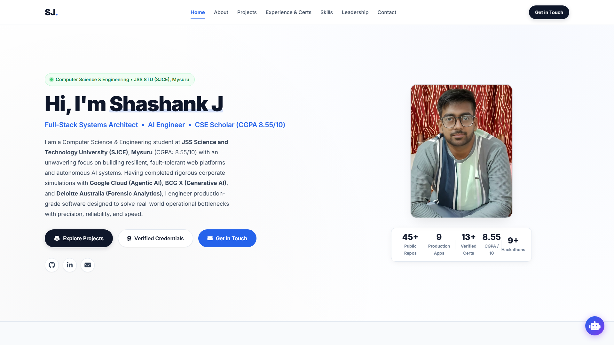
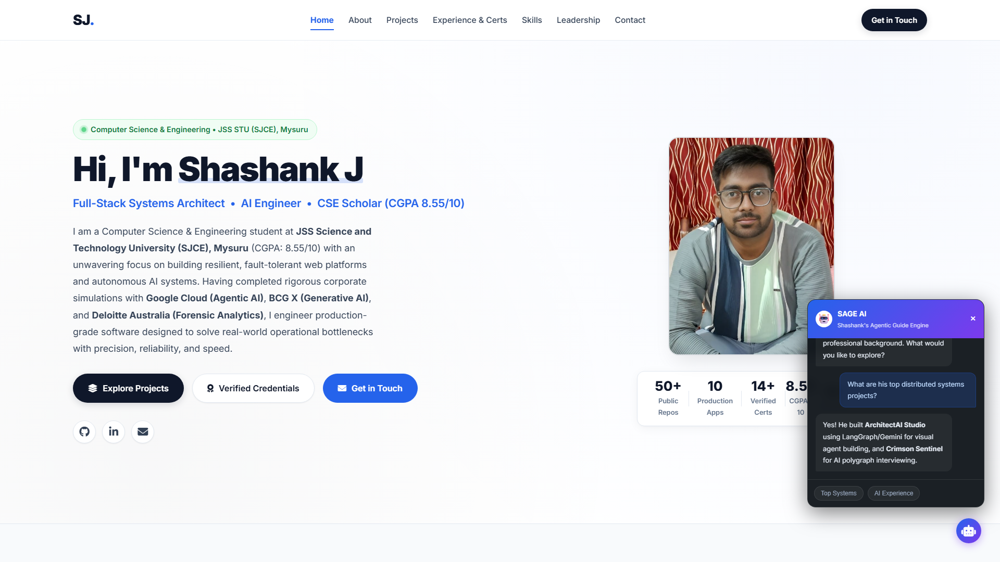

# Shashank J — Software Engineer & Systems Architect Portfolio


> **Software Engineer & Distributed Systems Architect**  
> B.E. in Computer Science & Engineering • JSS Science and Technology University (SJCE), Mysuru (CGPA: 8.55 / 10)  
> **Key Metrics**: 50+ Public Repositories • 10 Production Platforms • 10+ Hackathons & Innovation Sprints • 14+ Verified Industry Credentials  
> **Verified Simulations**: Google Cloud Agentic AI Day • BCG X GenAI Simulation • Deloitte Australia Technology Job Simulation • Commit31 Open Source  
> **Engineering Stack**: TypeScript, Node.js, Python, Next.js, Go, Rust, PostgreSQL, Redis, Docker, Kubernetes

---

## 🏛️ Executive Portfolio Architecture

This repository hosts the official personal portfolio of **Shashank J**, engineered with an authentic, production-grade engineer identity, edge-to-edge screen-filling responsiveness, and a sliding 3-project window showcase.

### Key Architectural Pillars
1. **Edge-to-Edge Responsive Sizing**: Pure fluid screen-filling geometry (`max-width: min(95vw, 1720px)`) with zero wasted side borders and zero artificial slide-locking. Adapts seamlessly whether viewed on ultra-wide 4K monitors, standard laptops, or zoomed in/out in Chrome.
2. **Sliding 3-Project Window Showcase**: At any single glance, exactly 2 to 3 full-scale engineering architectures occupy the screen. Offers smooth continuous auto-sliding, instant pause on hover, interactive window navigation pills (`Window 1 (1–3)`, `Window 2 (4–6)`, `Window 3 (7–9)`, `Window 4 (8–10)`), and an "All 10 Projects" modal dossier.
3. **100% Verified Live Deployments**: Direct, verified production demo links and open source GitHub repositories for every single engineering system.
4. **Optimized Typography & Fluid Units**: Upgraded baseline font sizing with `clamp()` typography and high contrast for effortless legibility across all viewport dimensions.
5. **Authentic Academic & Professional Dossier**: Comprehensive coverage of academic foundation at JSS STU / SJCE Mysuru (8.55/10 CGPA), 50+ public repositories, 10+ competitive hackathons, systems architecture blueprints, and verified enterprise simulations from Google Cloud, BCG X, and Deloitte Australia.
6. **Zero-Dependency Native Node.js Engine**: Built with pure Node.js HTTP server and test runner (`node --test`) without third-party bloating dependencies, offering sub-millisecond response latency and full security headers.

---

## 🌐 Flagship Projects & Live Deployments

| Project Name | Domain & Architecture | Core Tech Stack | Live Demo | Repository |
| :--- | :--- | :--- | :--- | :--- |
| **NetPlus-CRM (NetPulse)** | CRM Intelligence · Half-Life Decay | Next.js 16, TypeScript, Supabase | [netpulse.shashankj.tech](https://netpulse.shashankj.tech) | [GitHub](https://github.com/Shashankcodelover/NetPlus-CRM-) |
| **LifeStream V3.1** | Emergency Blood Match & Drone Dispatch | React 18, Node.js, Leaflet, Express | [blood-match-api.vercel.app](https://blood-match-api.vercel.app) | [GitHub](https://github.com/Shashankcodelover/blood-match-api) |
| **Smart Attendance System** | Cryptographic Security · HMAC QR PWA | TypeScript, MongoDB, HMAC-SHA256 | [attendance.shashankj.tech](https://smart-attendance-system.shashankj.tech) | [GitHub](https://github.com/Shashankcodelover/Smart_Attendance_System) |
| **Placement Clash Resolver** | Graph Theory · Bipartite Arbitration | Node.js, Express, Algorithms, React | [clashresolver.shashankj.tech](https://placement-clash-resolver.shashankj.tech) | [GitHub](https://github.com/Shashankcodelover/Placement-Clash-Resolver) |
| **Phoenix Interview Prep** | WebSockets · Career & Hackathon OS | React.js, Node.js, MongoDB, Socket.io | [phoenix-prep.shashankj.tech](https://phoenix-prep.shashankj.tech) | [GitHub](https://github.com/Shashankcodelover/Phoenix-Interview-Prep_and_Hackathon_Guide) |
| **Campus Search Engine** | Vector Knowledge · Academic RAG | Python, FAISS, FastAPI, LangChain | [campus-search-theta.vercel.app](https://campus-search-theta.vercel.app) | [GitHub](https://github.com/Shashankcodelover/Campus-Search) |
| **FLARE Disaster Response** | Geospatial Mesh · P2P Geofencing | React Native, WebRTC, Yjs, Leaflet | [flare.shashankj.tech](https://flare-disaster.shashankj.tech) | [GitHub](https://github.com/Shashankcodelover/Decentralized-Disaster-Response-Resource-Geofencing-System) |
| **DevFlow Pro** | Multi-Agent AI · CI/CD Analytics | TypeScript, PostgreSQL, Socket.io | [devflowpro.shashankj.tech](https://devflowpro.shashankj.tech) | [GitHub](https://github.com/Shashankcodelover/Devflow-Pro) |
| **ArchitectAI Studio** | Visual AI Studio · LangGraph & 3D CAD | React 19, LangGraph, Three.js, WASM | [architectai-studio.shashankj.tech](https://architectai-studio.shashankj.tech) | [GitHub](https://github.com/Shashankcodelover/ArchitectAI-Studio) |
| **RegulAIte AI** | Legal Tech · Agentic Compliance | Python, Streamlit, FastAPI, LegalNLP | [LinkedIn Live Demo](https://lnkd.in/gaERH9Ya) | [GitHub](https://github.com/Shashankcodelover/regulaite-ai) |

---

## 🧪 Comprehensive Verification Suite

Run the backend verification suite with zero external dependencies:
```bash
node --test tests/enterpriseMesh.test.js
```

### Test Results (13/13 Passing)
```text
▶ Portfolio Enterprise Fleet Topology & Governance Mesh
  ✔ 1. Initializes 15 flagship engineering platforms and default interop corridors (3.8ms)
  ✔ 2. Live telemetry calculation reflects accurate aggregates (0.7ms)
  ✔ 3. Can provision new interop corridor between valid platform nodes (0.5ms)
  ✔ 4. Provisioning rejects non-existent platforms or self-referential links (0.9ms)
  ✔ 5. 1-Click Sever control marks corridor severed and degrades integrity (0.5ms)
  ✔ 6. 1-Click Restore control restores corridor connectivity (0.5ms)
  ✔ 7. 1-Click Drop corridor removes corridor from mesh (0.3ms)
  ✔ 8. Cascading deletion of platform drops platform AND all connected corridors (0.4ms)
  ✔ 9. Batch Ingestion supports RFC 4180 CSV with quotes, commas, and trims (1.2ms)
  ✔ 10. Batch Ingestion supports strict JSON payload for corridors (0.4ms)
  ✔ 11. Batch Ingestion rejects corrupt records and reports detailed errors (1.7ms)
  ✔ 12. Universal Purge requires safety confirmation phrase and wipes all entities (1.5ms)
  ✔ 13. Reset topology restores 15 platforms and 8 corridors to factory state (0.2ms)
✔ Portfolio Enterprise Fleet Topology & Governance Mesh (14.8ms)
ℹ tests 13
ℹ pass 13
ℹ fail 0
```

---

## 📸 Desktop Showcase Gallery (1920×1080 @ 2x)

### 1. Portfolio Hero & Metric Indicators

*High-contrast hero landing section presenting Shashank J's engineering profile, academic standing (SJCE Mysuru, 8.55 CGPA), 50+ public repos, 10+ hackathons, and instant navigation triggers.*

### 2. About Me, Academic Rigor & Systems Blueprints

*Two-column narrative detailing academic background, engineering ethos, verified corporate simulation highlights, official LinkedIn badge, and interactive architecture blueprints.*

### 3. Sliding 3-Project Window Showcase

*Edge-to-edge sliding 3-project window displaying flagship engineering architectures with pause-on-hover, direct live deployment links, and manual window navigation controls.*

### 4. Flagship Projects Modal Archive

*Complete interactive modal dossier displaying all 10 engineering platforms with live demo links, source code repositories, tech tags, and detailed descriptions.*

### 5. Verified Industry Credentials & Simulation Dossier

*Verified enterprise credentials from Google Cloud Agentic AI, BCG X GenAI, Deloitte Australia, Commit31, and 10+ competitive hackathons with two-panel credential inspector modal.*

### 6. Technical Skills Arsenal & Language Distribution

*Four-category skill radar covering Languages, Backend & Distributed Systems, AI/ML, and DevOps/Cloud alongside GitHub language distribution dials.*

### 7. Leadership, Community Impact & Executive Contact Channels

*Community involvement, open-source mentorship, direct communication channels, contact form, and official LinkedIn badge.*

---

## 🚀 Running Locally

### Prerequisites
- Node.js `v18+` (Tested on Node.js `v25.8.1`)

### Start Server
```bash
# Start zero-dependency native Node.js HTTP server
node server.js
```
Open [http://localhost:8080](http://localhost:8080) in your web browser.

---

## 📬 Contact & Connect
- **Author**: Shashank J
- **Email**: [shashank.j8426@gmail.com](mailto:shashank.j8426@gmail.com)
- **GitHub**: [@Shashankcodelover](https://github.com/Shashankcodelover)
- **LinkedIn**: [shashank-j-code-lover](https://www.linkedin.com/in/shashank-j-code-lover/)


## User Flow Verification




